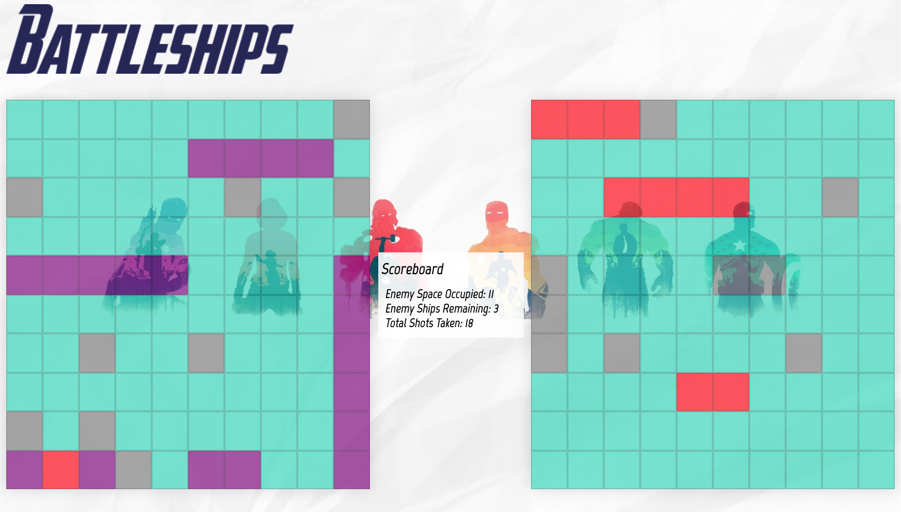
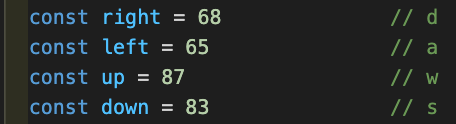
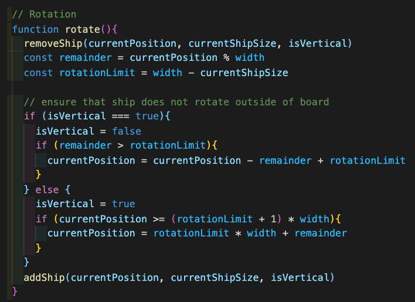
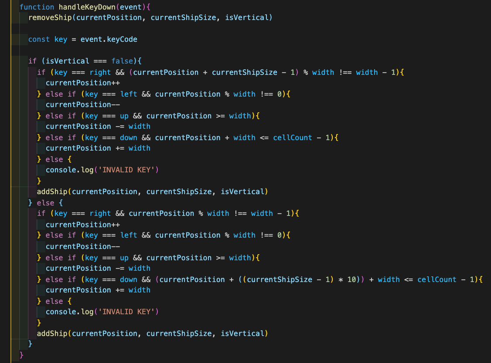
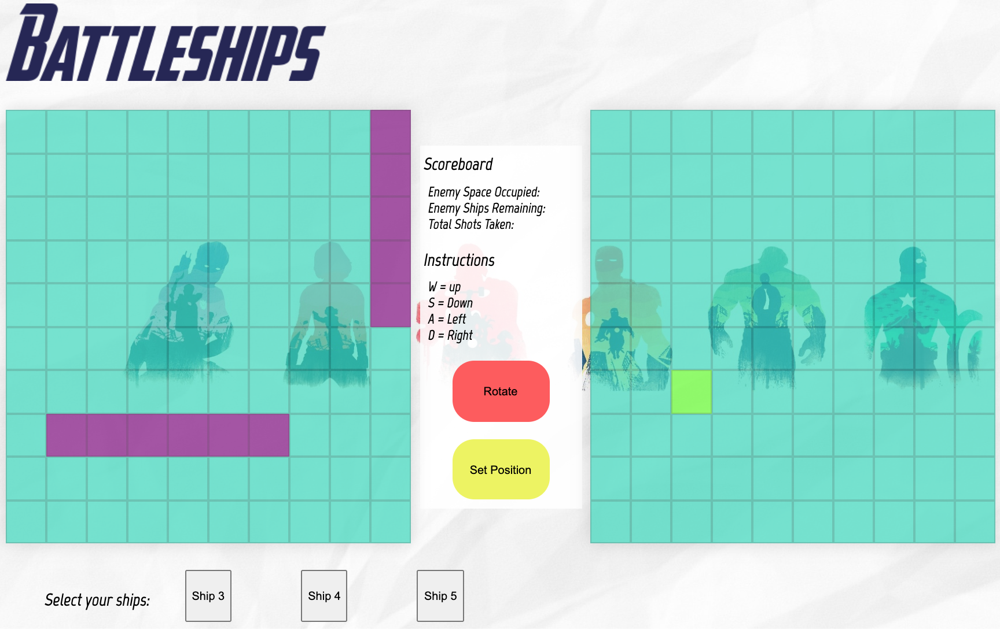
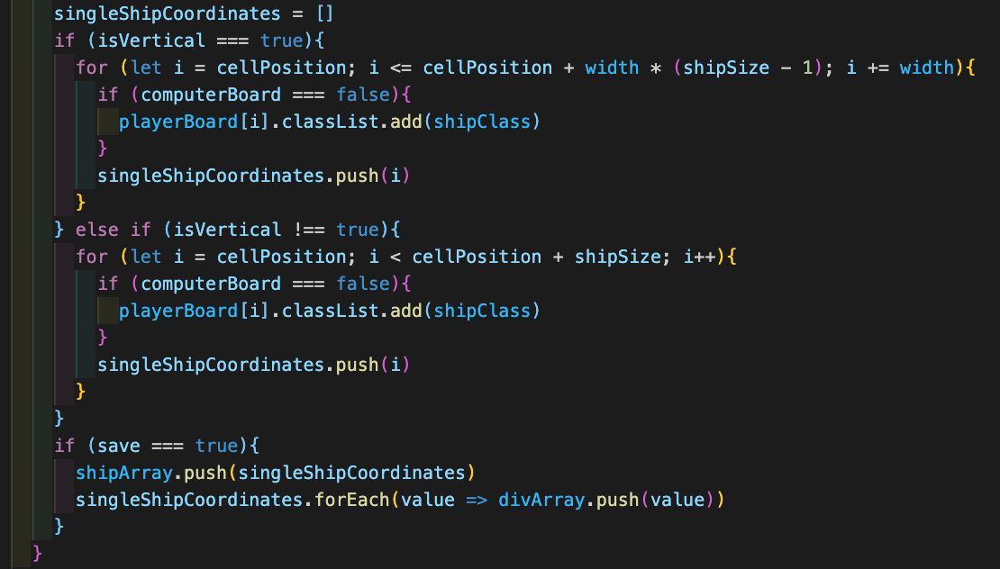
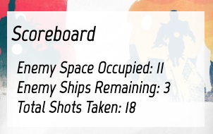
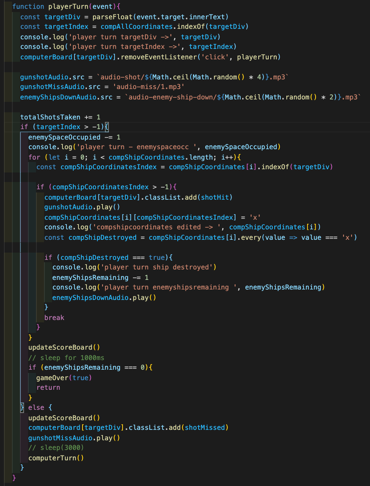
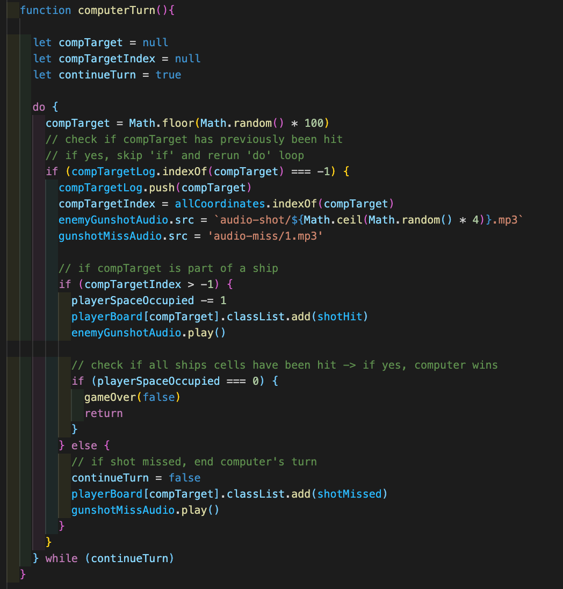

# Project 1 - Battleships Avengers
## Overview
The first project for the Software Engineering Course and personally my first project using JavaScript.
Battleships is a classic two-player board game where you position your ships on a grid and take turns shooting at specific coordinates in an attempt to sink the opposition's ships. In Battleships - Avengers, you play against the computer. The Avengers theme adds an exciting twist to the gaming experience.

Play Batteships Avengers <a href="https://luckymouse11.github.io/Project-1/" target="_blank">here</a>

## Brief:
To build a functioning browser game using Vanilla JavaScript.

**Timeframe: 8 days**

## Technologies Used:

- HTML5
- CSS3
- JavaScript
- Git

## Process
### Planning

On Day 1, the importance of creating a good wireframe and the use of pseudocode was strongly stressed. With this in mind, I began by researching similar games to help me come up with a final plan of how I wanted my game to look. I was then able to clearly mark in HTML terms the elements I would require and which were likely to be controlled by "Flexbox". Working out the logic for the computer’s player also presented a challenge as making the computer "smart" would require a lot more array methods and functionality.

Whilst some of the styling of the project was done as the project went along, most of it was left as the final steps of the development process of the game.

## Game Mechanics
### Ship placement

At the start of the game, players navigate the board and position their ships by using the W, S, A, D keyboard keys and a Rotate button. I used the WSAD keys as opposed to arrow keys as it would be more intuitive to gamers.

The placement of the individual ships is an integral part of the game. Therefore, considerations were taken to ensure that the ships always remain within the confines of the grid and that when ships are being set, they cannot overlap one another.

One of the trickier parts to the game mechanics was making sure that once all the pieces were set, the computer would recognise when a shot has hit or missed.

To do this, I had to create an array for the coordinates of each individual ship e.g. [1, 2], [25, 35, 45].

This was done by creating a new variable “ let singleShipCoordinates”. Let was used as this would allow the identifier to be reassigned, a necessity as there would be more than one ship's coordinates being pushed into an array. 
Part of this function would include the logic for keeping ships inside the grid coordinates when the user decides to rotate the ship. For this to be possible the ship in view would need to be removed as the user clicks rotate and then replaced with the same ship in its rotated position.

This would subsequently allow the successful placement of a ship in the “shipCoordinates” array, where all of the player's ships coordinates are stored.

Once the player has set all of their ship position these steps would be repeated for the computer, creating an array of ships as well as an array of each “div” (grid square) occupied by a computer ship. The array of computer ships div arrays e.g. [[1,2], [25, 35, 45]] would allow me to track ”Enemy Ships Remaining”. The array of computer ships div numbers e.g [1, 2, 25, 35, 45] would allow me to track the total number “Enemy Space Occupied”

### Player Turn
Upon starting the game the player selects a square on the grid to shoot. If it's a hit then the player gets another turn. If it’s a miss then it's the computer’s turn to take a shot.

The scoreboard tracks the stats of how many enemy ships are remaining and how many squares are still occupied.

Every shot would trigger an audio file to play, with an audio file for missed shots as well as a selection from multiple audio files upon a successful hit.

### Computer Turn
The computer logic would be a little different as automation would be required to make the game progress. The computer’s target would have to be declared as one of the 100 divs (grid spaces), however, a check would need to be run in case the computer randomly selects the same div more than once. To do this the initial selected div would have to be checked to see if it was part of the player’s ships, if yes an audio file is played and the selected div would be pushed out of the array. If no ship is hit, an audio file is played and the game continues.

As the scoreboard is updated an if/ else statement checks if the total number of “enemyShipsRemaining” after the player’s turn, or “playerSpaceOccupied” after the computer’s turn is “===” (strictly equal) to 0 to determine whether the game is over.

### Results
The conclusion of the project left me feeling pleased with what I had managed to accomplish in my first solo project using Vanilla JavaScript. I achieved my design priorities and the site's aesthetics were styled in such a way that it could be easily edited.

## Win/ Loss logic

The game ends when either the player or computer manages to sink all the opponent’s ships.
The number of ship coordinates that have not been hit are tracked for player and computer; after each successful hit, the game checks if this variable is now equal to 0 for the opponent. If yes, this then ends the game and triggers an alert declaring the winner.

## Known errors/ bugs

There is currently no time delay between computer and player turns, making the game "untidy" as audio files will overlap if a player starts clicking too quickly.

## Wins and Challenges

### Wins
- Experiencing how to think programmatically as well as gaining problem-solving skills.
- Coming up with a theme to suit the game - this made it easier to be invested in the development process.

### Challenges
- The mathematical side of things - factoring in the placement of the ships and edge-case handling to ensure that ships can only rotate and land within the grid.
- Implementing a time delay between turns.
- Making the computer smart and being able to toggle difficulties.

## Future Improvements

- As noted in the challenges, working on a time delay between player and computer turns so there are no issues with overlapping audio.
- Adding a "Game Restart" button for users to restart the game without having to reload the page.
- Making the computer smart and having the option to toggle difficulty. Ideally, there would be an Easy Mode, where the computer fires shots randomly; a Medium Mode where the computer's target array would surround the previous shot coordinates if it hit a ship, therefore increasing the chances of consecutive hits; Hard Mode where the computer's target array would further decrease in size following the direction of the ship hit or have memory of previous hits.
- Changing the "ships" to more creative shapes than just straight lines on the grid.

## Key Learning

Taking on the challenge of Battleships was a great experience for me as it allowed me to reinforce the things I have learnt in JavaScript, such as DOM manipulation and different array methods. I was also able to appreciate the value of pseudo code and planning in order to increase efficiency.
